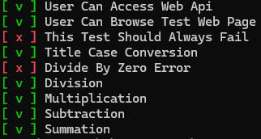

# neattesting.py | reference
This repository will host the public source of **neattesting** tool in order to accept contributions.
For now, it is the documentation for this.



## Considetaions

* It loads entire test suites.
* These methods cannot accept parameters.
* Decision making methods must return a boolean (True or False) values.
* These methods must import their own libraries, themselves, and be operable in isolation.
* This is NOT the unit testing mechanism; no true assetions.

The alternative is to use a proper unit testing application / software.

## Usage Example 1: Registry Mode

```
from neattesting import TestPerformer

from cases import BusinessLogicTests
from cases import MathematicalTests

if __name__ == "__main__":
    tp = TestPerformer()

    tp.perform(BusinessLogicTests(), True)
    tp.perform(MathematicalTests(), True)
    # ...
```

In this example, `BusinessLogcTests` is a test suite which contains test_* methods, each returning boolean flags.
One example of `BusinessLogcTests` is `MathematicalTests` below as:

```
from business import BusinessLogic

class MathematicalTests(BusinessLogic):

    def test_summation(self) -> bool:
        a: int = 1
        b: int = 2
        expected_sum: int = 3
        actual_sum = a + b
        return expected_sum == actual_sum
```

The method should return a boolean decision. Perform the tests like:
```
from neattesting import TestPerformer
from cases import MathematicalTests

testhost = MathematicalTests()
transparency = True

tp = TestPerformer()
tp.perform(testhost, transparency)
```
The test engine will look for test_* methods, and perform the call.
Expected output is something simlar to:

```
[ v ] Summation
```

## Usage Example 2: Individual Selection Mode

You can define a specific file to run.
The scanner will look for all available **test_** methods in it.

```
from neattesting_kafal import TestIndividual

if __name__ == "__main__":
    ti = TestIndividual()
    ti.perform("./cases/APIPerformanceTests.py")
    ti.perform("./cases/BusinessLogicTests.py")
    ti.perform("./cases/MathematicalTests.py")
    # ...
```

## Usage Example 3: Perform Everything

You will define ./cases folder to scan for test classes.

```
from neattesting_kafal import TestEverything

if __name__ == "__main__":
    te = TestEverything()
    te.perform("./cases")
```

* In this mode, you MUST remove the non-test classes from the **cases** folder.
* Folder name MUST be **cases**, that holds the test classes.

In all  modes of operations, you should design your test case in such a way
that __repeating tests__ does not bother your application heavily. Like:

* adding or deleting resources in the database
* Fast and frequent API calls

Finally,

* Test case's constructor should be called once per test.
* There are no setup() and teardown() like features.
* The constructor in the test case does not accept any parameters.
* The constructor will run once for a set of tests. So, you can reuse their public variables.
* The cases may run in any order, by one thread only, in a sequencial manner.